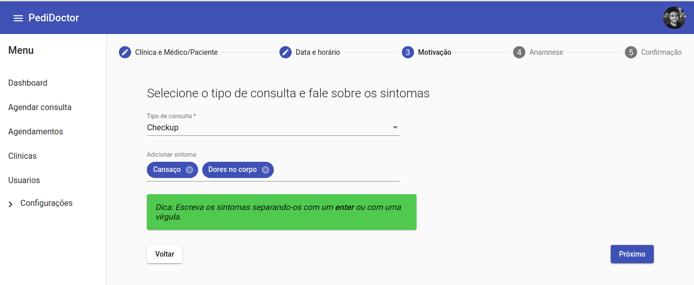
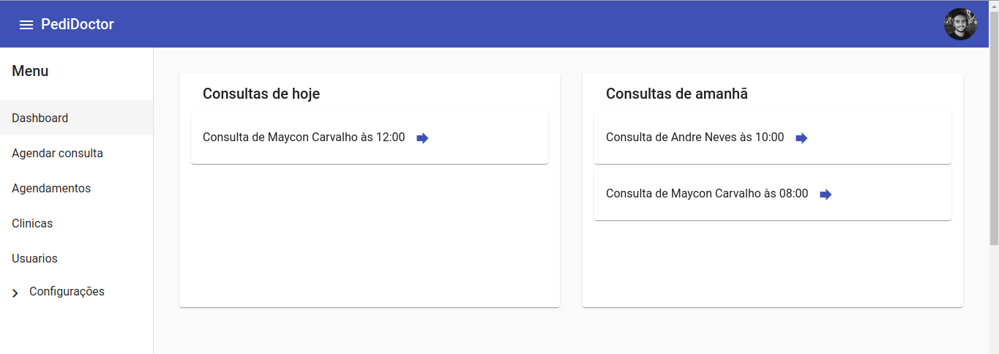
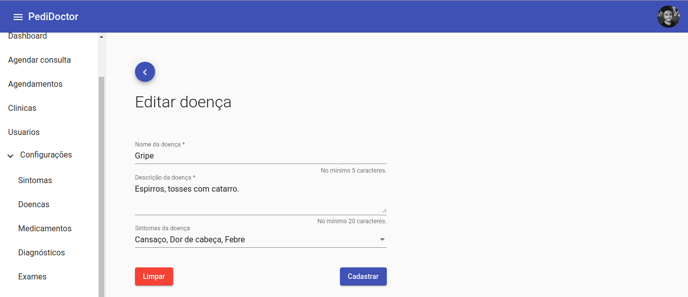

# Pedidoctor

Sistema que tem como objetivo centralizar a marcação de consultas para diferentes clínicas médicas

- Backend (Node.js): https://github.com/AndreNeves97/pedidoctor-nodejs
- Frontend (Angular): https://github.com/AndreNeves97/pedidoctor-angular


## Imagens

### Marcação de consultas




<br>

### Dashboard


<br>

### Cadastros gerais



<br>

### Cadastro de clínicas


## Instalação de dependências

```bash
$ npm install
```


## Execução em desenvolvimento

```bash
# Sem debug
$ npm run start:dev

# Com debug
$ npm run start:debug

```


## Execução em produção

```bash
# Compilação
$ npm run build

# Execução
$ npm run start

```


## Ferramentas utilizadas

- [Nest framework](https://github.com/nestjs/nest)
- [GraphQL](https://graphql.org/)
- [MongoDB](https://www.mongodb.com/)
