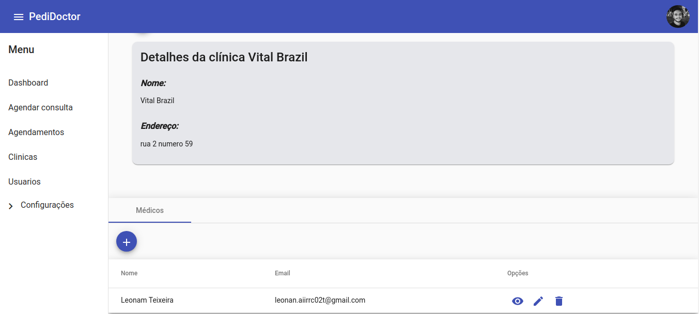

# Pedidoctor

Sistema que tem como objetivo centralizar a marcação de consultas para diferentes clínicas médicas

- Backend (Node.js): https://github.com/AndreNeves97/pedidoctor-nodejs
- Frontend (Angular): https://github.com/AndreNeves97/pedidoctor-angular


## Imagens

### Marcação de consultas


<br>

### Dashboard


<br>

### Cadastros gerais


<br>

### Cadastro de clínicas



## Instalação de dependências

```bash
$ npm install
```


## Execução em desenvolvimento

```bash
# Sem debug
$ npm run start:dev

# Com debug
$ npm run start:debug

```


## Execução em produção

```bash
# Compilação
$ npm run build

# Execução
$ npm run start

```


## Ferramentas utilizadas

[Nest](https://github.com/nestjs/nest) framework TypeScript starter repository.

## Installation

```bash
$ npm install
```

## Running the app

```bash
# development
$ npm run start

# watch mode
$ npm run start:dev

# production mode
$ npm run start:prod
```

## Test

```bash
# unit tests
$ npm run test

# e2e tests
$ npm run test:e2e

# test coverage
$ npm run test:cov
```

## Support

Nest is an MIT-licensed open source project. It can grow thanks to the sponsors and support by the amazing backers. If you'd like to join them, please [read more here](https://docs.nestjs.com/support).

## Stay in touch

- Author - [Kamil Myśliwiec](https://kamilmysliwiec.com)
- Website - [https://nestjs.com](https://nestjs.com/)
- Twitter - [@nestframework](https://twitter.com/nestframework)

## License

  Nest is [MIT licensed](LICENSE).
